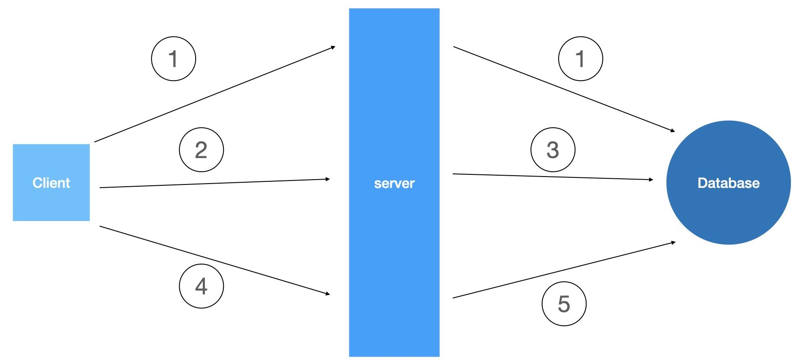
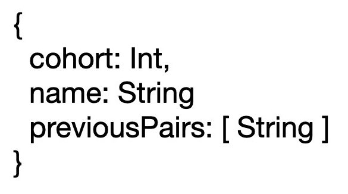
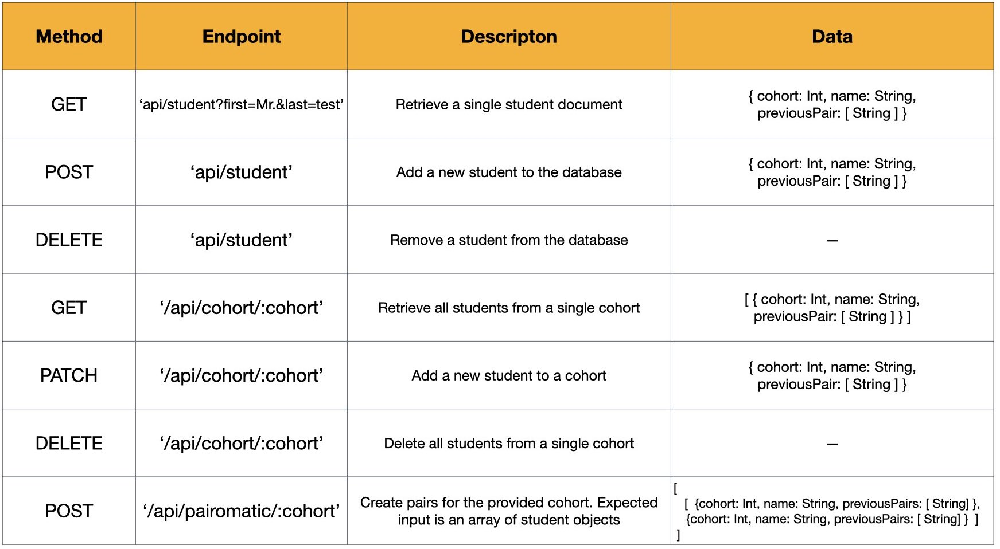

# pair-o-matic
Programmatically make pairs for students. It doesn't sound useful until you need it.

### Motivation
One of our responsibilities involved making pairs for students assigning them a partner to work with for the week. This was something that is not too difficult for smaller class sizes, but became increasingly difficult as class sizes got bigger. We decided to automate the process. The basic flow of how the app works is as follows

* A user selects a class to make pairs for. \(1\) A GET request is sent to the server. The server retrieves the class roster from the database and sends it to the client.
* With a class roster, a user can create specific pairs that they want for the week. A user can make as many or as few pairs here as they want.
* When happy with their selected pairs a POST \(2\) is sent to the client of the user selected pairs.
* The server will get the full class roster from the database \(3\). Students paired by the user are filtered out of the class roster, the server will make a variety of pairing options from the remaining students and send it back to the client.
* The user can go through the pairing options and choose the one they like, they can also make manual adjustments to the pairs
* When the user is happy with the pairs, the selected pairing roster is sent in a POST \(4\) to the server
* \(5\) Each student document is updated with their current pair for the week.

### Being worked on

1. Finish some Front End components
2. Add styling to UI

## Current Schema and API's

We kept the schema simple, a single MonogDB library where each student is a single document. The one to many relationship of a student with people they have already worked with will be limited so for our use case it made sense to track that inside each student document.

There are api's for routine admin tasks, as well as the route that will make the pairs, and save user selected pairs.

#### Technologies

* React/React Hooks
* Node/Express
* Mongoose/MongoDB